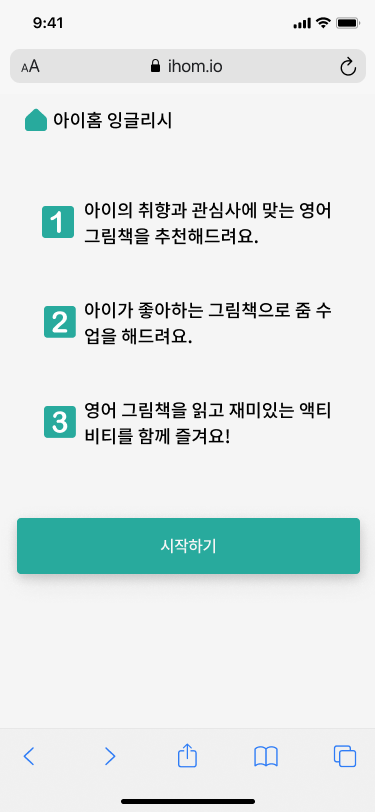

## 00. Project Introduction

> **AI 가 찾아주는 아이의 취향과 그림책 추천 서비스  "iHome" 을 소개합니다.**

|  |  |
| --- | --- |
|  |  |

### Needs

" **데이터 셋 수집 어려움 "**

5~7세 아이들은 직접 프로필을 작성하는데에 어려움이 있어. 아이들의 정확한 취향을 파악하기 어렵다.

또한 아이들의 개인정보를 기반으로  추천시스템을 개발하기에 이미 수집된 데이터가 부족하기 때문에 Cold Start 문제가 발생할 수 있다.

따라서  **이미지 인식을 통한 취향 파악과 라벨을 기준으로 한 유사도 검색 및 추천 기능 도입**으로 으로 이 문제를 해결하려고 한다.

### Main **POC**

아이가 좋아하는 사물 (장난감, 장소)을 업로드 및 촬영하여

1)  **객체 (사물, 색감, 분위기) 를 추출하고**
2)  **유사도 검색을 통해**

아이 취향에 알맞는 도서를 추천해주는 AI 서비스다.

---

## 01. Software Architecture

| Role | Framework & Tech |
| --- | --- |
| Frontend | </a> |
| Backend | </a>&nbsp </a>&nbsp </a>&nbsp </a>&nbsp |
| AI | </a>&nbsp </a>&nbsp |
| Web Server & Container | </a>&nbsp </a>&nbsp  |

### AI

- Google Colab :
- Tensorflow
- Object Detection : SSD
- Text Embedding : universal-sentence-encoder

Google Colab 환경에서 Tensorflow로 모델을 학습 시켰습니다. 학습된 모델을 저장하여 flask 서버 상에서 api와 연결하여, object detection을 수행하고 label을 반환하는 프로세스입니다. Object Detection 모델은 SSD를 사용하였습니다. 

Tensorflow의 universal-sentence-encoder를 사용해 책 리스트의 텍스트 메타 데이터를 벡터 값으로 변환 시켰습니다. 앞서 도출된 label 값을 임베딩하여, 엘라스틱서치에 벡터 값으로 변환된 라벨 값을 input으로 주고 cosine similarity 쿼리를 사용해, 유사도 검색을 수행했습니다. 

[TensorFlow Hub](https://tfhub.dev/google/universal-sentence-encoder/4)

### Backend

- Webserver : NGINX (middleware : gunicorn)
- API Server : Flask
- Model Server : Flask
- Database : PostgreSQL
- Message Broker / Worker : RabbitMQ, Celery

### Frontend

- React
각 페이지마다 사용자 응답에 따라 인터페이스를 변경시키기 위해 REACT 프레임워크를 사용했습니다. app.js를 기본 페이지로 두고 각각의 구현 페이지를 컴포넌트로 가져와 url 페이지 분기로 출력하는 형식입니다. 

- 사용 라이브러리
**react-router-dom**
페이지 로딩 없이 페이지에 필요한 컴포넌트를 불러와 렌더링하는 라이브러리 react-router-dom을 사용하여 페이지를 구성했습니다. 

**react-webcam**
모바일 뿐만 아니라 pc에서도 장난감 사진을 캡쳐하기 위해 pc용 웹캠 모듈을 사용했습니다. 

**axios**
캡쳐한 장난감 사진 파일을 back으로 보내고, ai 검색 결과 책 목록 데이터를 response.data로 가져올 때 axios 라이브러리를 사용합니다.

### Search Engine

- Elasticsearch ( Cosinesimilarity )

### Container Virtualization & Deploy

- Docker
- AWS / EC2

---

## 03. 팀원

| Name | Role | Description |
| --- | --- | --- |
| 홍명주 | Frontend | 
- React JS Hooks 기반 프론트엔드 설계
- UI/UX 퍼블리싱
- 반응형 웹앱 제작
- 스플래시 화면, 로딩창 구현|
| 김서연 | 팀장 / DevOps | 
- Docker를 통한 기술스택 Containerized
-  NHN 클라우드 배포
- ElasticSearch, text embedding 및 cosine similarity 검색 기능 구현
|
| 박지영 | Backend |
- Flask REST API구현, Swagger명세화
- 서버 분리, 유효성 검사 및 예외 처리
- Rabbitmq, Celery를 통한 비동기 처리구현, 서버 성능 향상
|
| 김하연 | Backend | 
- PostgreSQL 개발, 스키마 설계
- ORM 활용  (SqlAlchemy)
- Celery task 데이터 처리 
- NHN Cloud 배포
|
| 한수아 | Data Engineering | 
- Tensorflow SSD 객체 인식 모델 구현
- AI 모델 성능 최적화
- 성능 시각화를 통한 모니터링
- Google Colab 사용 
|
| Robin Park | Backend |
- Elasticsearch 쿼리 구현
- 배포 자료 수집 |

