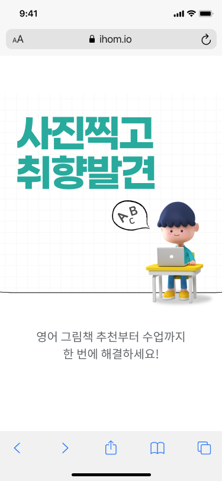
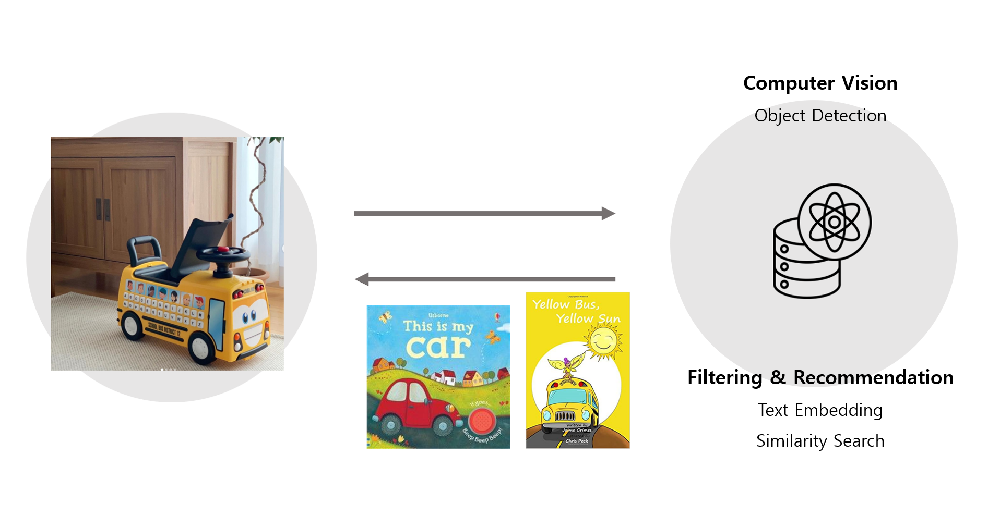
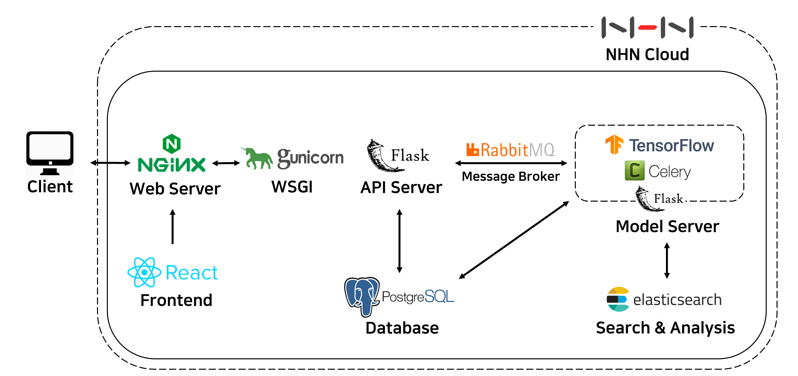
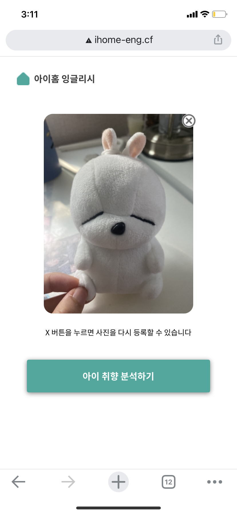
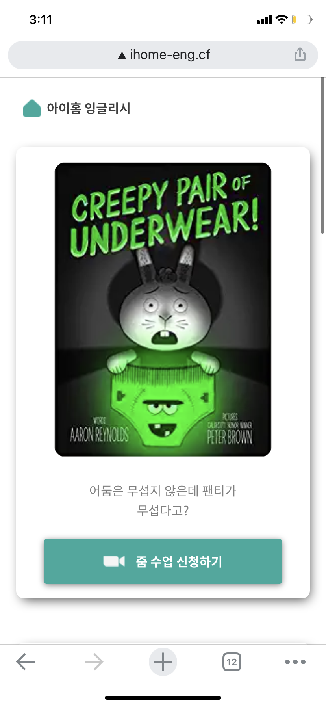

# README.md

# 00. Project Introduction

> **Introducing children picture book AI reccommendation service "IHOME" based on Object Detection*

|   |   |
|---|---|
|   |   |

### 👉[DEMO : YouTube Link ](https://www.youtube.com/watch?v=ZtOEeWc1jy4)

 
## 🔎Needs
Early PoC was an AI English picture book recommendation service for children aged 5-7. Early PoC was a service that makes children write their own profiles and recommends picture books for them through recommendation algorithms based on tastes identified through preliminary surveys.

However, ***children aged 5-7 have difficulties writing their own profiles, so there are difficulties expecting accurate surveys.***

Also, there was not enough data collected in advance to develop the recommendation algorithm, causing a ***'cold start' problem.*** Considering that it is inefficient to collect the taste of children aged 5-7 and the appropriate book data directly, we sought to implement recommendation service that does not require prior data.

## 🌟Main **PoC**

Therefore, our team decided to introduce a recommendation system that does not require prior data by using ***"Object Detection + Similarity search."***

Our team's MAIN PoC is "AI picture book recommendation service based on object detection."

When you upload a child's favorite things (toy, object .. etc),

1) ***Extract labels through object detection***

2) ***And utilize text similarity search*** 

Our AI service recommends books suitable for children's taste.

With these services, parents can curate books that are semantically similar to their children's favorite toys by simply taking photos. Also, there is an advantage that it can interest children in the process of taking pictures.

---

# 01. Software Architecture

 

## 📍Backend
</a>
</a>
</a>
</a>

- **API Server / Model Server : Flask**

A lightweight Web framework based on Python. It provides minimal structure and is not complicated, reducing development time. We separated the backend server into API servers that communicate with the front end and model servers that perform major functions such as object detection and similarity search. This reduced the load on the server and pursued a micro-service approach.

- **Database : PostgreSQL**

Open source object-relational database system (ORDBMS) for data storage and management.

Process data without creating SQL query statements directly with Python-based object-relational mapping (ORM). In API Server (Flask), the SQLAlchemy module was used to define book data schemas, insert data, and query.

- **Message Broker / Worker : RabbitMQ, Worker**

**RabbitMQ**

Python is an interprity language and operates as a single thread. To overcome these Python limitations, we use Message Queuing.

**Celery**

Use Celery as a worker for asynchronous operations to compensate for Python's slow speed.

Set Celery's Result Backend to PostgreSQL. Creates a UUID for each task, designates it as a primary key, and stores the index of the list of recommended books, which is the result of the task. If Frontend sends requests periodically until the results of the Task are stored in PostgreSQL, it returns and outputs the results of the query from the API Server.

This asynchronous processing ensures that the server is always in a responsive state.

- **Webserver : NGINX (middleware : gunicorn)**

We built a RESTful API server using the Gunicorn interface that helps communicate with Nginx, a lightweight but high-performance reverse proxy web server.

## 📍Frontend
</a>

- **React**
The REACT framework was used to change the interface according to user responses on each page. The format in which app.js is the default page and each implementation page is imported as a component.

**[Libraries]**

**react-router-dom**
The page was configured using the library react-router-dom, which loads and renders the necessary components of the page without page loading.

**react-webcam**
We use PC webcam module to capture toy photos not only with mobile phones but also with pc.

**axios**
Use the axios library for REST API communication with FLASK. Based on Promise, Axios can use async/await grammar to make XHR requests very easy.

## 📍AI & Search Engine
</a>
</a>
</a>

| INPUT  | OUTPUT  |
|---|---|
|   |   |

### Object Detection

- **Google Colab**
- **Tensorflow**
- **Object Detection : SSD**

On Google Colab, we trained the object detection model with Tensorflow. And we attached the learned model with api on the flask server to extract labels via object detection. The Object Detection model we used is SSD.

[SSD GITHUB](https://github.com/balancap/SSD-Tensorflow)

### Text Embedding & Similarity Search

- **Elasticsearch**
- **Text Embedding: Universal Sentence Encoder**
The text metadata in the book list was converted to vector values using Tensorflow's universal-sentence-encoder. By embedding the derived label value, we gave the label value converted to the vector value to input to the elastic search and performed a similarity search using cosine similarity queries. 

[TensorFlow Hub](https://tfhub.dev/google/universal-sentence-encoder/4)

## 📍Container Virtualization & Deploy
</a>

- **Docker**

The container was built through the Docker Compose file to develop and manage the necessary images integrally.

- **NHN Cloud**

We created an instance in NHN Cloud Service Toast and install dockers, built containers to deploy the service.

---
# 03. How to get started

1.  ` git clone https://github.com/SiliconValleyLorax/i-home ` 

2. `cd frontend`

3. `npm i`

4. `cd .. [Root Folder with docker-compose.yml]`

5. `docker-compose up --build`

---
# 03. Contributors

| Name | 김서연 | 홍명주  | 박지영 |
|---|---|---|---|
|Role| Leader/DevOps | Frontend | Backend |
|Detail|Technical Stack Containerization through Docker / NHN Cloud Server Deployment / ElasticSearch, text embedding, and cosine similarity search capabilities | Frontend design based on React JS Hooks / UI/UX publishing / Reactive web app production / Splash screen, loading window implementation | Flask REST API implementation / Swagger specification / Server Division, validation and exception handling / Asynchronous processing implementation with Rabbitmq, Celery, server performance improvement|

| Name | 김하연 | 한수아  | Robin Park |
|---|---|---|---|
|Role| Backend | Data Engineering | Backend |
|Detail | PostgreSQL Usage, Schema Design / Usage of ORM Framework (SQLAlchemy) / Process Celery task data / NHN Cloud Server Deployment | Tensorflow SSD object recognition model implementation / AI model performance optimization / Monitor with performance visualization / Google Colab Usage | Elasticsearch Queries Implementation / Research |

